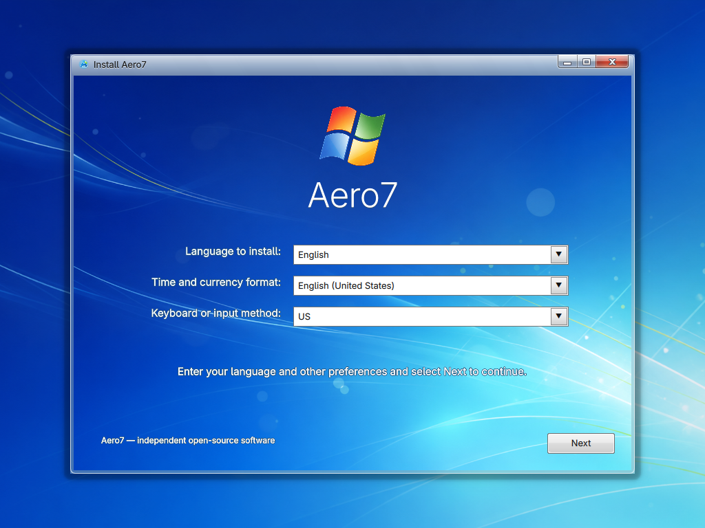
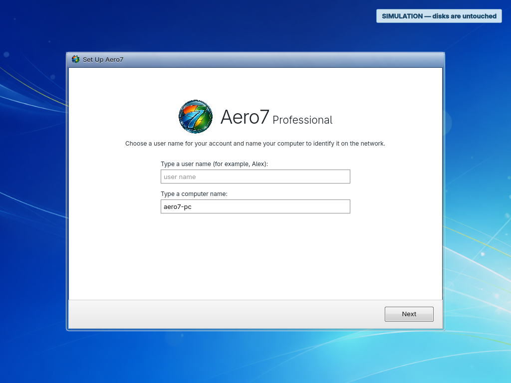
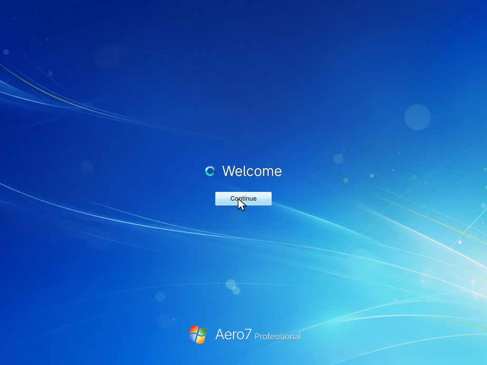

<a id="readme-top"></a>

<div align="center">


# Aero7

### The familiar Aero desktop, rebuilt on modern Linux

Aero7 is an independent Arch Linux-based operating system with a guided,
full-screen installer and a KDE Plasma 6 Wayland desktop inspired by the calm,
glassy desktop design of the late 2000s.

[](https://github.com/memegeko/aero7/releases/tag/v0.1.0-beta.1)
[](https://archlinux.org/)
[](https://kde.org/plasma-desktop/)
[](https://wayland.freedesktop.org/)
[](docs/PUBLIC-RELEASE-CHECKLIST.md)

[**Download Beta 1**](https://github.com/memegeko/aero7/releases/tag/v0.1.0-beta.1) ·
[**Read the Handbook**](wiki/Home.md) ·
[**Report a bug**](https://github.com/memegeko/aero7/issues/new) ·
[**Aero7-shell**](https://github.com/memegeko/aero7-shell)

</div>

---

> [!IMPORTANT]
> **Beta 1 is a VM-only testing release.** Its destructive installer accepts
> only a disposable VirtIO disk inside a supported virtual machine. Current
> development builds add guided advanced options for unallocated space,
> replacing one selected partition, and shrinking an NTFS partition, but these
> must pass the dual-boot VM and real-hardware test gates before physical-disk
> execution is enabled. Encryption, free-form manual partitioning, and legacy
> BIOS remain unsupported.
>
> **Public redistribution is not approved yet.** The repository and prerelease
> remain private while the retained Plymouth animation, project marks, and full
> repository history complete the reviews listed in the
> [public-release checklist](docs/PUBLIC-RELEASE-CHECKLIST.md).

## Meet Aero7

Aero7 turns a complete Arch Linux installation into a cohesive classic desktop
experience. It boots directly into a purpose-built graphical setup—there is no
live desktop to wander through—and continues after installation with account,
password, time zone, update, and network personalization.

Under the glass it remains a modern Linux system: Plasma 6, Wayland, PipeWire,
NetworkManager, systemd-boot, signed packages, and the rolling Arch package
base. The goal is familiar interaction without pretending to be Windows or
hiding the open-source system underneath.

<p align="center">
  
</p>

## What makes it different

| | |
| --- | --- |
| **A real guided installer** | A dedicated Qt 6/QML flow for language, licensing, installation, progress, restart, and first-boot setup. |
| **No live desktop** | The ISO opens directly in a focused Cage kiosk, with a recovery console kept out of the way on TTY2. |
| **Aero from boot to desktop** | Matching boot animation, installer frame, setup screens, login branding, sounds, icons, taskbar, Start menu, and applications. |
| **Modern Linux foundation** | Arch Linux, KDE Plasma 6 Wayland, PipeWire, NetworkManager, systemd, and a focused `plasma-desktop` installation. |
| **Signed Aero7 packages** | Desktop components and applications come from the dedicated signed [Aero7 package repository](https://github.com/memegeko/aero7-repo). |
| **Safety-first Beta** | Disk and partition identities are fingerprinted, rechecked immediately before changes, and backed up before an advanced layout is written. |

## The setup experience

```text
Language → Install now → License → Installation type → Disk confirmation
         → Installing → Restart → Personalization → Welcome → Desktop
```

The first installed boot continues naturally into OOBE. Create your account,
choose a password and computer name, review update and regional settings, and
arrive at the desktop through the Welcome and Preparing your desktop screens.

<p align="center">
  
  
</p>

## Included desktop

Beta 1 installs a focused Plasma desktop rather than the broad Plasma or KDE
application meta-packages. Aero7 then adds its own signed desktop set:

- AeroShell workspace, Start menu, taskbar, window decoration, icons, and sounds;
- Aero Dolphin, presented as **File Explorer**;
- Aero Gwenview, presented as **Photo Viewer**;
- Linux Control Panel and Device Manager;
- Aero KolourPaint, Gadgets, execbin, LinVer, and TuxManager;
- QTerminal presented as **Command Prompt**;
- VLC presented as **Media Player**, Spectacle as **Snipping Tool**,
  KCalc as **Calculator**, and FeatherPad as **Notepad**;
- Ark archive integration, Wine compatibility components, and branded Fastfetch.

WinXplorer remains optional and is not installed by the ISO. Sevulet is not
included because its source and redistribution terms have not been verified.

## Download and try Beta 1

1. Open the [Beta 1 release](https://github.com/memegeko/aero7/releases/tag/v0.1.0-beta.1).
2. Download the `.iso` and matching `.sha256` file.
3. Verify the checksum before booting the image.
4. Create an x86-64 UEFI virtual machine with at least 4 GB RAM and a disposable
   40 GB VirtIO disk.
5. Boot the ISO and follow the on-screen installer.

Detailed VM settings, checksum commands, screenshots, recovery shortcuts, and
troubleshooting are in the [Installation handbook page](wiki/Installation.md).

## Beta 1 support matrix

| Area | Beta 1 support |
| --- | --- |
| Architecture | x86-64 |
| Firmware | UEFI |
| Tested hypervisor | QEMU/KVM |
| Target storage | Disposable VirtIO disk, 16 GB minimum; 40 GB recommended |
| Partitioning | Whole-disk GPT, 1 GiB FAT32 ESP, ext4 root |
| Desktop | KDE Plasma 6 Wayland |
| Networking | Required during package installation |
| Physical hardware | Blocked in Beta 1 |
| Dual boot / encryption / manual layout | Not available in Beta 1 |

## Documentation

The [Aero7 handbook](wiki/Home.md) is the main documentation source. Its
versioned pages are also ready to synchronize to GitHub Wiki:

- [Installation](wiki/Installation.md)
- [Installer guide](wiki/Installer-Guide.md)
- [First boot and OOBE](wiki/First-Boot-and-OOBE.md)
- [Included software](wiki/Included-Software.md)
- [Troubleshooting](wiki/Troubleshooting.md)
- [Known issues](wiki/Known-Issues.md)
- [Architecture](wiki/Architecture.md)
- [Building the ISO](wiki/Building-the-ISO.md)
- [Security and disk safety](wiki/Security-and-Disk-Safety.md)
- [Credits and licensing](wiki/Credits-and-Licensing.md)

## Related projects

| Project | Role |
| --- | --- |
| [Aero7-shell](https://github.com/memegeko/aero7-shell) | Desktop configuration, recovery tooling, application recipes, and post-install integration |
| [Aero7 package repository](https://github.com/memegeko/aero7-repo) | Signed binary packages consumed during installation |
| [AeroThemePlasma](https://github.com/aeroshell-desktop/aerothemeplasma) | Core Plasma visual components |
| [PlymouthVista](https://github.com/furkrn/PlymouthVista) | Compatibility boot-theme base used by the requested Plymouth experience |

## Project status

Aero7 is experimental Beta software. Automated checks cover the installer state
machine, destructive-operation gates, package manifest, OOBE, boot configuration,
QML, and embedded release contents. Beta 1 is intended for disposable VM testing
and feedback—not a personal workstation or irreplaceable data.

See the [Beta 1 release notes](docs/BETA1-RELEASE-NOTES.md) and
[validation report](docs/validation.md) for the exact artifact and test record.
Public-release status is tracked separately in the
[public-release checklist](docs/PUBLIC-RELEASE-CHECKLIST.md).

## License and trademark notice

The Aero7 installer source is distributed under the [MIT License](LICENSE).
Third-party packages, themes, fonts, and artwork retain their own licenses and
notices; see [THIRD_PARTY.md](THIRD_PARTY.md) before redistributing an image.
The open-source code license does not by itself grant rights to every bundled
visual asset.

Aero7 is an independent open-source project. It is not affiliated with,
authorized, sponsored, endorsed, or approved by Microsoft Corporation. Windows
is a trademark of the Microsoft group of companies. Aero7 recreates interface
ideas and does not include a licensed copy of Microsoft Windows.

<p align="right">(<a href="#readme-top">back to top</a>)</p>
