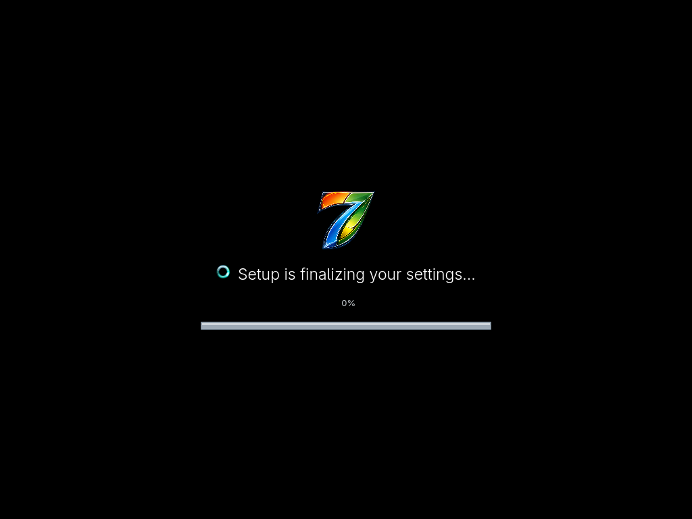

<a id="readme-top"></a>

<div align="center">


# Aero7

### The familiar Aero desktop, rebuilt on modern Linux

Aero7 is an independent Arch Linux-based operating system with a guided,
full-screen installer and a KDE Plasma 6 Wayland desktop inspired by the calm,
glassy desktop design of the late 2000s.

[](https://github.com/memegeko/aero7/releases/tag/v0.1.0-beta.1)
[](docs/BETA2-RELEASE-NOTES.md)
[](https://archlinux.org/)
[](https://kde.org/plasma-desktop/)
[](https://wayland.freedesktop.org/)

[**Official Website**](https://aero7.miku-dayo.com/) ·
[**Download Beta 1**](https://github.com/memegeko/aero7/releases/tag/v0.1.0-beta.1) ·
[**Read the Handbook**](wiki/Home.md) ·
[**Report a bug**](https://github.com/memegeko/aero7/issues/new) ·
[**Aero7-shell**](https://github.com/memegeko/aero7-shell)

</div>

---

> [!IMPORTANT]
> **Beta 1 supports guarded installation on x86-64 UEFI PCs and virtual
> machines.** It can target non-removable SATA, NVMe, MMC, and VirtIO disks when
> booted from genuine Aero7 installation media. This remains Beta software:
> back up important data, disconnect unrelated disks, and verify the
> selected disk before continuing. Encryption, free-form manual partitioning,
> legacy BIOS, and Secure Boot remain unsupported.

> [!NOTE]
> **Beta 2 source and documentation are prepared, but the Beta 2 ISO files are
> not published yet.** Beta 1 remains the current download. The Beta 2 online
> and offline images will be published only after the remaining fresh-install
> and graphical release gates pass.

## Meet Aero7

Aero7 turns a complete Arch Linux installation into a cohesive classic desktop
experience. It boots directly into a purpose-built graphical setup—there is no
live desktop to wander through—and continues after installation with account,
password, time zone, update, and network personalization.

Under the glass it remains a modern Linux system: Plasma 6, Wayland, PipeWire,
NetworkManager, systemd-boot, signed packages, and the rolling Arch package
base. The goal is familiar interaction without pretending to be Windows or
hiding the open-source system underneath.

<p align="center">
  
</p>

## What makes it different

| | |
| --- | --- |
| **A real guided installer** | A dedicated Qt 6/QML flow for language, licensing, installation, progress, restart, and first-boot setup. |
| **No live desktop** | The ISO opens directly in a focused Cage kiosk, with a recovery console kept out of the way on TTY2. |
| **Aero from boot to desktop** | Matching boot animation, installer frame, setup screens, login branding, sounds, icons, taskbar, Start menu, and applications. |
| **Modern Linux foundation** | Arch Linux, KDE Plasma 6 Wayland, PipeWire, NetworkManager, systemd, and a focused `plasma-desktop` installation. |
| **Signed Aero7 packages** | Desktop components and applications come from the dedicated signed [Aero7 package repository](https://github.com/memegeko/aero7-repo). |
| **Safety-first Beta** | Disk and partition identities are fingerprinted, rechecked immediately before changes, and backed up before an advanced layout is written. |

## The setup experience

```text
Language → Install now → License → Installation type → Disk confirmation
         → Installing → Restart → Personalization → Welcome → Desktop
```

The first installed boot continues naturally into OOBE. Create your account,
choose a password and computer name, review update and regional settings, and
arrive at the desktop through the Welcome and Preparing your desktop screens.

<p align="center">
  
  
</p>

Every installer and first-boot page is shown in the
[Installer Guide](wiki/Installer-Guide.md) and
[First Boot and OOBE](wiki/First-Boot-and-OOBE.md) handbook pages. The
[Screenshot Gallery](wiki/Screenshot-Gallery.md) also shows the installed
desktop, Start menu, applications, system popups, lock screen, and
authentication prompt.

## Included desktop

The Beta 2 source line installs a focused Plasma desktop rather than the broad Plasma or KDE
application meta-packages. Aero7 then adds its own signed desktop set:

- AeroShell workspace, Start menu, taskbar, window decoration, icons, and sounds;
- Aero Dolphin, presented as **File Explorer**;
- Aero Gwenview, presented as **Photo Viewer**;
- Linux Control Panel and Device Manager;
- Aero KolourPaint, Gadgets, execbin, LinVer, and TuxManager;
- QTerminal presented as **Command Prompt**;
- VLC presented as **Media Player**, Spectacle as **Snipping Tool**,
  KCalc as **Calculator**, and FeatherPad as **Notepad**;
- Ark archive integration, Wine compatibility components, and branded Fastfetch.
- Plasma Network Management, UFW firewall management, and English and Dutch
  spell-check dictionaries for the matching Control Panel settings.
- AccountsService, UPower, power-profiles-daemon, and PipeWire services for
  the Control Panel's native account, battery, power, and sound pages.

Programs Center Beta is optional and is not installed on a fresh system. Its
checksum-verified package is retained locally so it can be enabled through
**Turn Aero7 features on or off**, even without an internet connection. The
[Optional Features guide](wiki/Optional-Features.md) explains every feature.

WinXplorer remains optional and is not installed by the ISO. Sevulet is not
included because its source and redistribution terms have not been verified.

## Current download and Beta 2 media

When Beta 2 media is published, the **offline ISO is recommended**. It includes the
complete installation package set and is normally much faster and more
reliable, especially on slower laptops, because setup does not wait for package
mirrors. Choose the smaller online ISO only when download size is more important
and the computer will have a stable Internet connection for the entire install.
Both variants retain the configured repositories for updates after setup.

1. Open the [Beta 1 release](https://github.com/memegeko/aero7/releases/tag/v0.1.0-beta.1).
2. Download the `.iso` and matching `.sha256` file.
3. Verify the checksum before booting the image.
4. Write the ISO to a USB drive with Ventoy or Rufus, or attach it to an x86-64
   UEFI virtual machine.
5. Boot the installer and follow the on-screen setup.

Detailed Ventoy, Rufus, VM, checksum, recovery, and troubleshooting instructions
are in the [Installation handbook page](wiki/Installation.md).

## Installer support matrix

| Area | Support |
| --- | --- |
| Architecture | x86-64 |
| Firmware | UEFI |
| Tested environments | UEFI physical PC and QEMU/KVM |
| Target storage | Non-removable SATA, NVMe, MMC, or VirtIO, 16 GiB minimum |
| Partitioning | Whole-disk GPT, or guarded GPT New/Format/Shrink targets; 1 GiB FAT32 ESP and ext4 root |
| Desktop | KDE Plasma 6 Wayland |
| Networking | Required by the smaller online image; not required by the Beta 2 offline image |
| Physical hardware | Supported for Beta testing; Secure Boot off and AHCI storage required |
| Dual boot / encryption / manual layout | Guided preservation is experimental; encryption and free-form layouts are unavailable |

## Documentation

Visit the [official Aero7 website](https://aero7.miku-dayo.com/) for project
news, downloads, and an overview of the complete system. The
[Aero7 handbook](wiki/Home.md) is the main technical documentation source. Its
versioned pages are also ready to synchronize to GitHub Wiki:

- [Installation](wiki/Installation.md)
- [Installer guide](wiki/Installer-Guide.md)
- [First boot and OOBE](wiki/First-Boot-and-OOBE.md)
- [Included software](wiki/Included-Software.md)
- [Aero7 optional features](wiki/Optional-Features.md)
- [Screenshot gallery](wiki/Screenshot-Gallery.md)
- [Troubleshooting](wiki/Troubleshooting.md)
- [Known issues](wiki/Known-Issues.md)
- [Architecture](wiki/Architecture.md)
- [Project boundaries](docs/project-boundaries.md)
- [Building the ISO](wiki/Building-the-ISO.md)
- [Security and disk safety](wiki/Security-and-Disk-Safety.md)
- [Credits and licensing](wiki/Credits-and-Licensing.md)

## Related projects

| Project | Role |
| --- | --- |
| [Aero7-shell](https://github.com/memegeko/aero7-shell) | Desktop configuration, recovery tooling, application recipes, and post-install integration |
| [Aero7 package repository](https://github.com/memegeko/aero7-repo) | Signed binary packages consumed during installation |
| [AeroThemePlasma](https://github.com/aeroshell-desktop/aerothemeplasma) | Core Plasma visual components |
| [PlymouthVista](https://github.com/furkrn/PlymouthVista) | Compatibility boot-theme base used by the requested Plymouth experience |

## Project status

Aero7 is experimental Beta software. Beta 2 source, package definitions, and
documentation are prepared on their project branches; ISO artifacts remain
withheld until fresh online and offline installations, reboot behavior, desktop
interaction, and failure recovery are accepted. Automated checks cover the
installer state machine, destructive-operation gates, package manifests, OOBE,
boot configuration, QML, optional-feature transactions, and embedded release
contents. Do not use a test build on a production workstation or a disk
containing irreplaceable data.

See the [Beta 2 release notes](docs/BETA2-RELEASE-NOTES.md) for the candidate
scope and remaining gates. The [Beta 1 release notes](docs/BETA1-RELEASE-NOTES.md)
and [validation report](docs/validation.md) remain the record for the currently
published artifact.

## License and trademark notice

The Aero7 installer source is distributed under the [MIT License](LICENSE).
Third-party packages, themes, fonts, and artwork retain their own licenses and
notices; see [THIRD_PARTY.md](THIRD_PARTY.md) before redistributing an image.
The open-source code license does not by itself grant rights to every bundled
visual asset.

Aero7 is an independent open-source project. It is not affiliated with,
authorized, sponsored, endorsed, or approved by Microsoft Corporation. Windows
is a trademark of the Microsoft group of companies. Aero7 recreates interface
ideas and does not include a licensed copy of Microsoft Windows.

<p align="right">(<a href="#readme-top">back to top</a>)</p>
