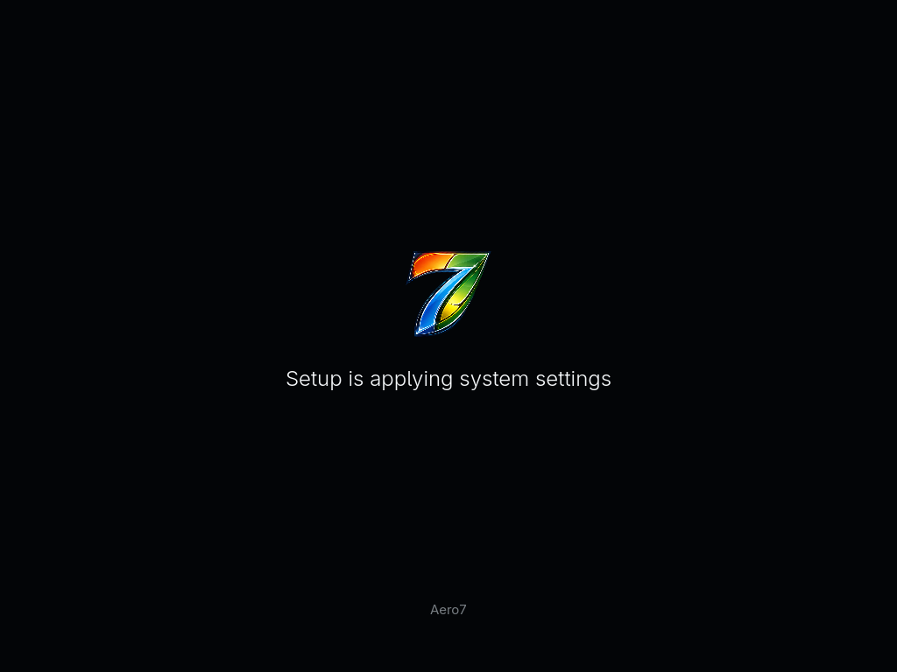
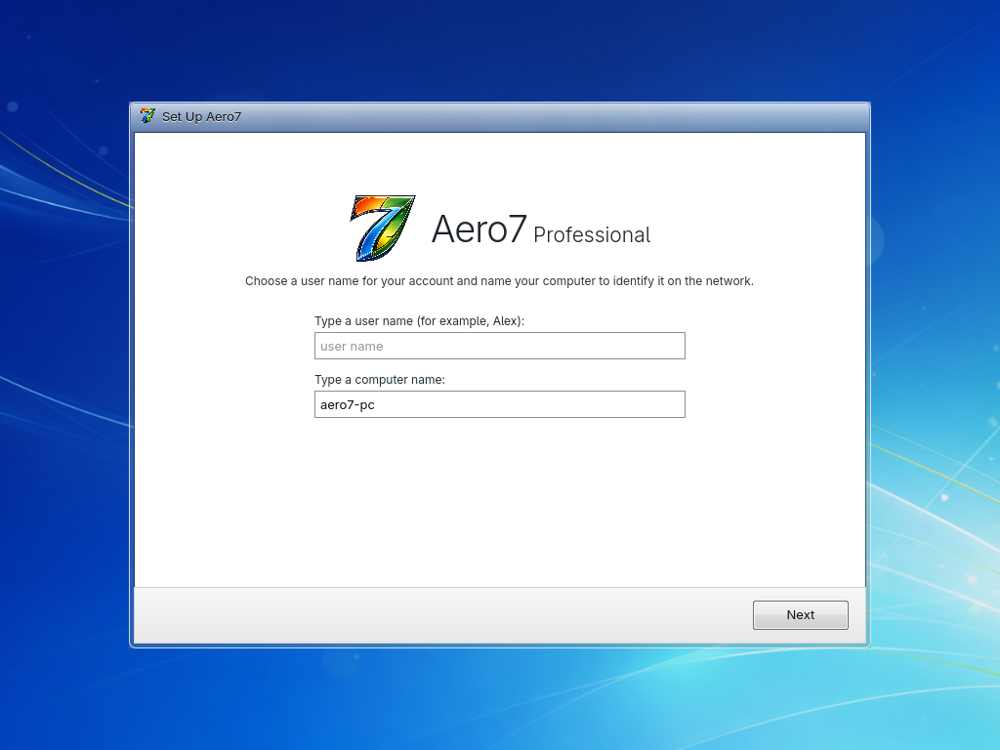
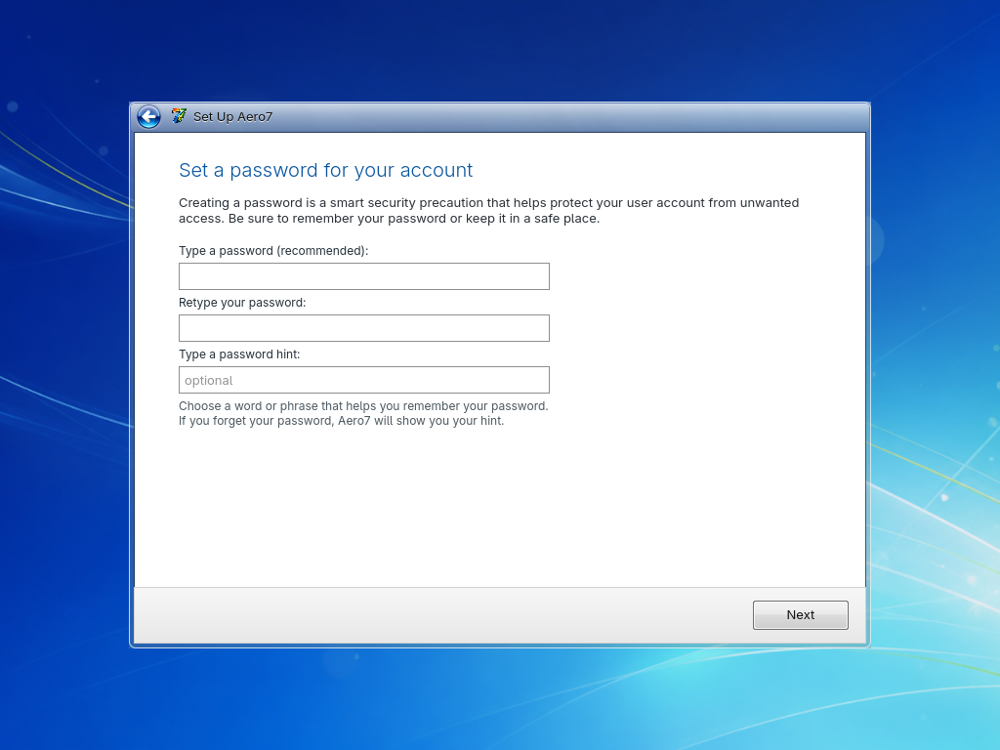
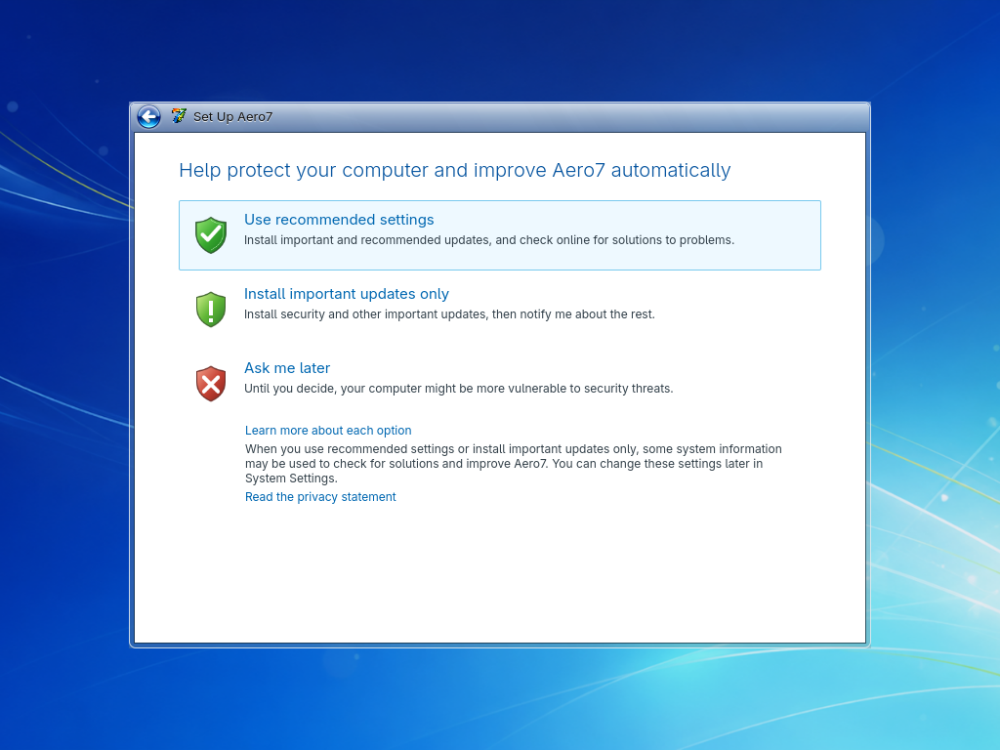
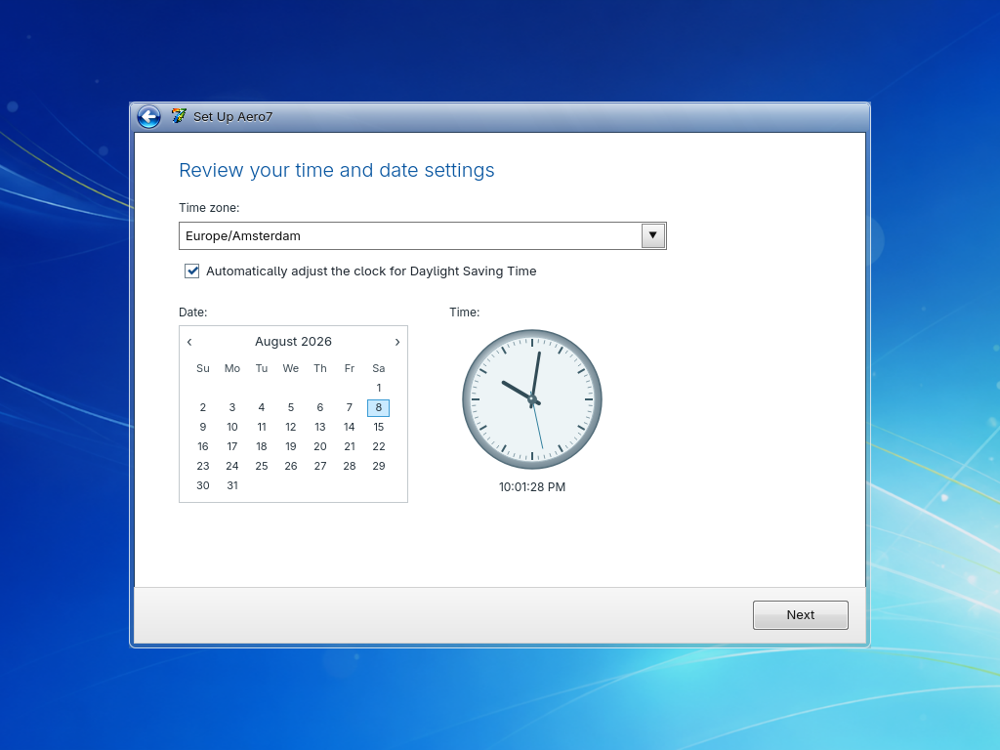
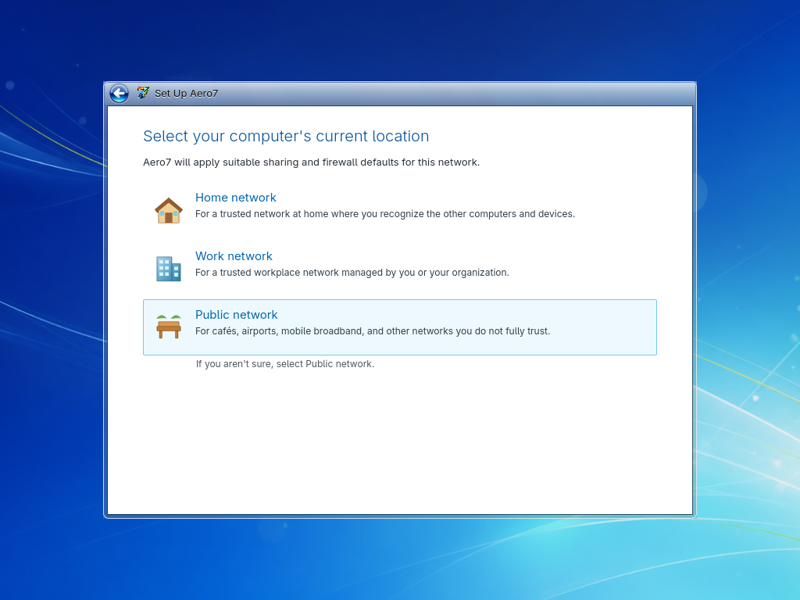
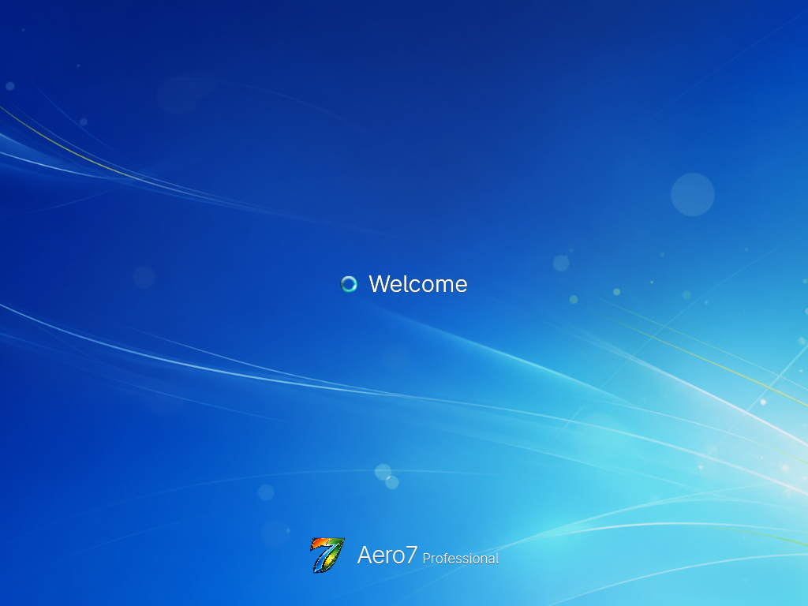
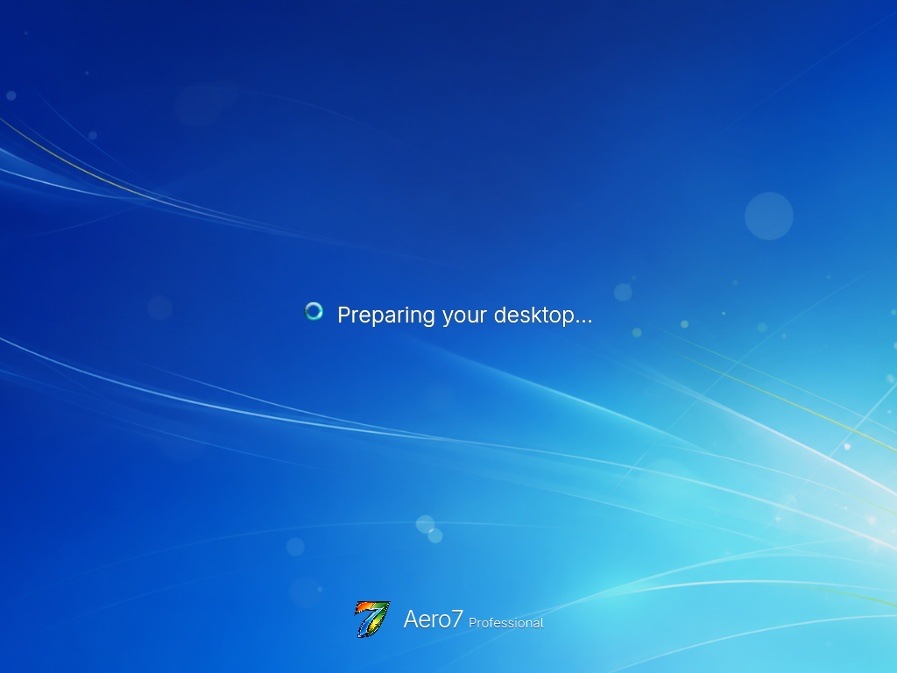
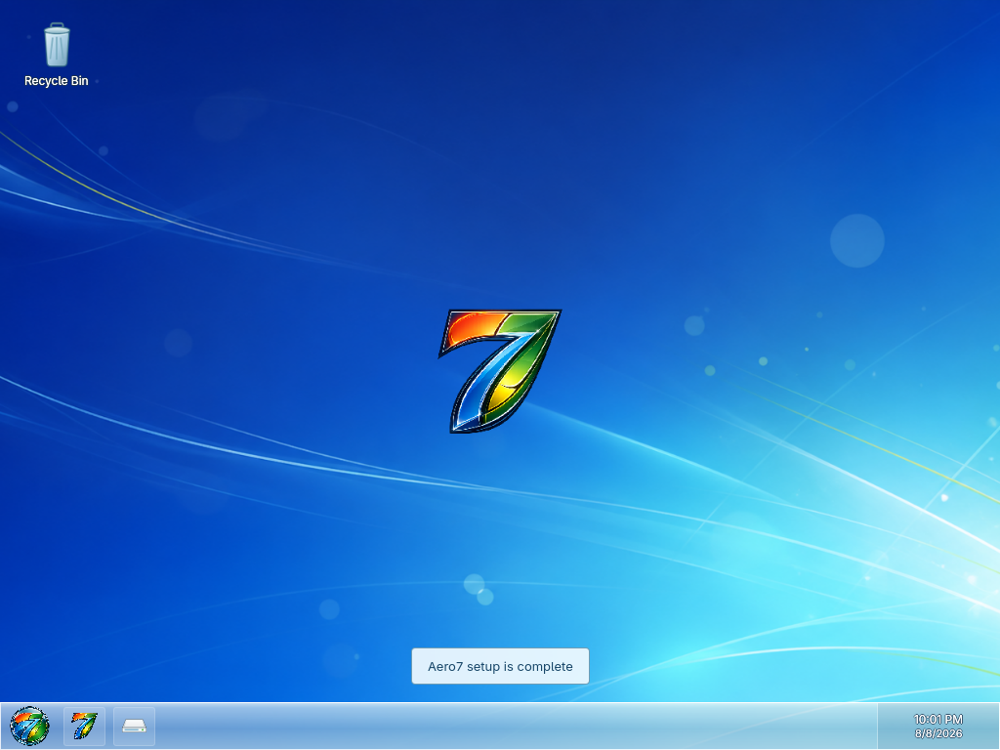

# First Boot and OOBE

The first installed boot starts a one-time Cage/Qt setup service instead of a
normal desktop login.

| Applying system settings | Checking video performance |
| --- | --- |
|  |  |

## Personalization pages

1. **User and computer name** — creates the normal Linux account and hostname.
2. **Password** — requires matching values and applies the account password.
3. **Update preference** — records the selected update policy.
4. **Time and date** — chooses the system time zone.
5. **Network location** — stores the selected network profile intent.
6. **Finalizing** — applies the Aero7-shell image-mode configuration.

| Account and computer name | Password |
| --- | --- |
|  |  |

| Update preference | Date, time, and time zone |
| --- | --- |
|  |  |

| Network location | Finalizing settings |
| --- | --- |
|  |  |

## Desktop preparation

OOBE applies the light Aero color scheme, wallpaper, Start menu, single Aero
taskbar, window decorations, icons, sounds, SDDM branding, application names,
and first-login repair service. The system then shows Welcome and Preparing
your desktop before starting Plasma directly—there is no second reboot and no
manual Continue button.

| Welcome | Preparing your desktop |
| --- | --- |
|  |  |

## One-time automatic login

The first desktop session logs in automatically so the transition feels
continuous. A self-disabling cleanup timer removes that temporary SDDM setting
after 45 seconds. Later boots require the account password normally.

## User name rules

Use a normal Linux account name: lower-case letters and digits are safest. Do
not use `root` or an existing system account. The computer name must be a valid
hostname and must not contain spaces.

## Recovery

If OOBE cannot finish, switch to TTY2 with Alt+F2 and inspect the commands in
[Recovery and Logs](Recovery-and-Logs.md). The one-time service remains
diagnosable and does not
create a passwordless sudo rule.
