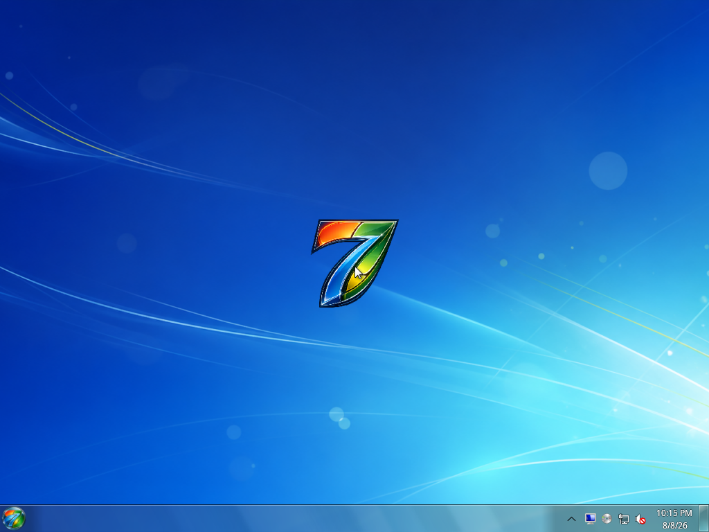

# Aero7 Wiki

  

Welcome to the handbook for **Aero7**, an independent Arch Linux-based operating
system with a Windows-7-era-inspired installer and KDE Plasma 6 Wayland desktop.

> **Beta 1 is a VM-only testing release.** The installer intentionally accepts
> only a disposable VirtIO disk inside a supported virtual machine. Do not use
> it for a personal workstation or irreplaceable data.
>
> **Public redistribution is not approved yet.** The private Beta is completing
> an artwork-rights, mark, and repository-history review. See
> [Testing and Release](Testing-and-Release.md) for the release gate.

## Start here

| I want to… | Read… |
| --- | --- |
| Download and install Beta 1 | [Installation](Installation.md) |
| Check whether my VM is supported | [System Requirements](System-Requirements.md) |
| Understand every setup page | [Installer Guide](Installer-Guide.md) |
| Learn what happens after restart | [First Boot and OOBE](First-Boot-and-OOBE.md) |
| See which programs are included | [Included Software](Included-Software.md) |
| Browse the current interface | [Screenshot Gallery](Screenshot-Gallery.md) |
| Fix a failed or black-screen boot | [Troubleshooting](Troubleshooting.md) |
| Open the recovery console | [Recovery and Logs](Recovery-and-Logs.md) |
| Review Beta limitations | [Known Issues](Known-Issues.md) |

## Technical documentation

- [Architecture](Architecture.md)
- [Security and Disk Safety](Security-and-Disk-Safety.md)
- [Building the ISO](Building-the-ISO.md)
- [Testing and Release](Testing-and-Release.md)
- [Public Release Readiness](Public-Release-Readiness.md)
- [Credits and Licensing](Credits-and-Licensing.md)
- [FAQ](FAQ.md)

## Published private Beta 1 artifact

| | |
| --- | --- |
| File | `aero7-beta1-2026.08.02-x86_64.iso` |
| Size | 1,406,070,784 bytes |
| SHA-256 | `64115bd497315a871d06786160016487eb9e3eb514fc48900c770a8d9fc6feec` |
| Firmware | x86-64 UEFI |
| Desktop | KDE Plasma 6 Wayland |
| Intended target | Disposable QEMU/KVM VM |

Authorized private testers can download it from the
[Beta 1 GitHub release](https://github.com/memegeko/aero7/releases/tag/v0.1.0-beta.1).

The newer local validation candidate is
`aero7-beta1-2026.08.08-x86_64.iso` (SHA-256
`a7a41fa71de988ace8dc498867763cce341fc5a38e16e7a0a350a69ba4f60e53`).
It is the source of the current installed-system screenshots and is undergoing
real-hardware testing. It has not replaced the published prerelease asset.

## Project links

- [Aero7 repository](https://github.com/memegeko/aero7)
- [Aero7-shell](https://github.com/memegeko/aero7-shell)
- [Signed Aero7 package repository](https://github.com/memegeko/aero7-repo)
- [Issue tracker](https://github.com/memegeko/aero7/issues)

Aero7 is not affiliated with or endorsed by Microsoft Corporation. It does not
contain a licensed copy of Microsoft Windows.
