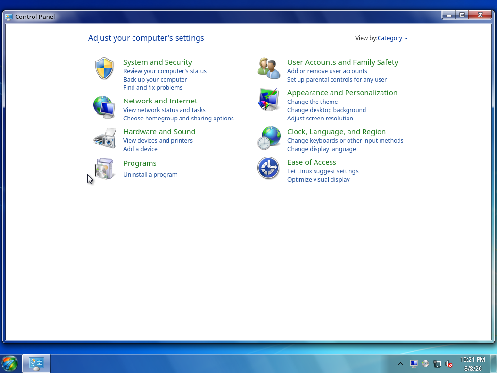
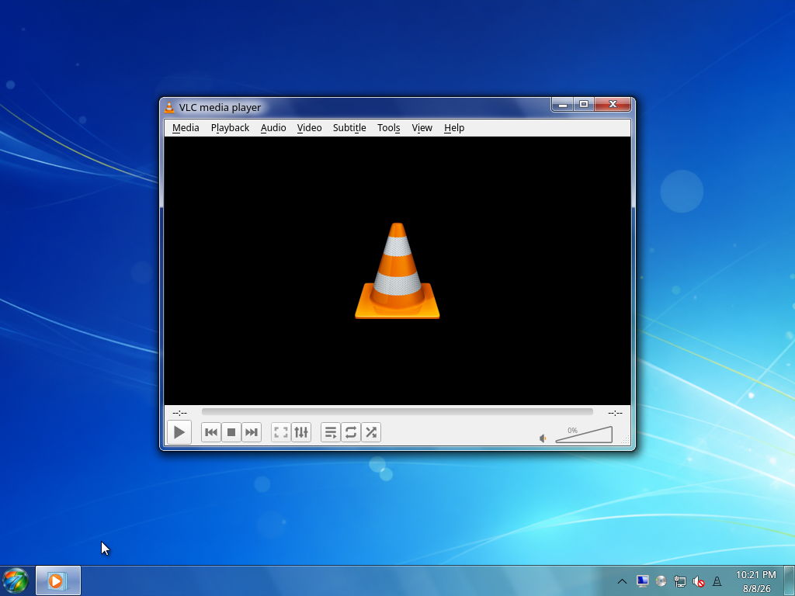

# Included Software

Beta 1 deliberately installs `plasma-desktop`, not the broad `plasma-meta` or
`kde-applications-meta` collections. Runtime dependencies are resolved normally,
then the signed Aero7 repository adds the themed desktop components.

## Foundation

- Arch Linux base system and Linux kernel;
- KDE Plasma 6 Wayland;
- systemd and systemd-boot;
- NetworkManager;
- PipeWire, PipeWire Pulse, and WirePlumber;
- Mesa graphics stack;
- Qt 6 and Cage;
- SDDM;
- Wine, Wine Mono, and Wine Gecko;
- Plymouth.

## Aero7 desktop packages

- AeroShell libplasma, workspace, and KWin components;
- AeroThemePlasma desktop, icon, and sound packages;
- SMOD and the Aero taskbar/Start menu integration;
- UAC-style PolicyKit agent;
- focused light color and wallpaper defaults;
- Aero7 first-login repair and management commands.

## Applications

| Displayed name | Package / role |
| --- | --- |
| File Explorer | Aero Dolphin |
| Photo Viewer | Aero Gwenview |
| Control Panel | Linux Control Panel |
| Device Manager | linux-devmgmt |
| Paint | Aero KolourPaint |
| Gadgets | Aero7 gadgets package |
| Task Manager | TuxManager |
| Command Prompt | QTerminal with Aero7 launcher branding |
| Media Player | VLC using the Aero7 Qt desktop theme |
| Snipping Tool | Spectacle region capture to the clipboard |
| Calculator | KCalc |
| Notepad | FeatherPad using the Aero7 Qt desktop theme |
| Archive support | Ark |
| Version information | LinVer |
| Windows executable helper | execbin |

## Intentionally absent

- WinXplorer is optional and is not installed by the ISO;
- Sevulet is excluded until source and redistribution terms can be audited;
- Kate and Okular are not part of the focused Beta 1 image;
- Konsole is replaced by the lighter QTerminal package;
- CMake, Ninja, `base-devel`, and other source-build tools are not installed on
  the finished binary-package system;
- Plasma Discover and the broad KDE Applications set are not pulled through a
  meta-package.

Every requested signed Aero7 package is queried again after installation. A
copy of the exact request is stored at:

```text
/var/lib/aero7/requested-aero7-packages.txt
```

## Current application captures

| File Explorer | Photo Viewer |
| --- | --- |
|  |  |

| Control Panel | Command Prompt |
| --- | --- |
|  |  |

| Media Player | Task Manager |
| --- | --- |
|  |  |

See the [Screenshot Gallery](Screenshot-Gallery.md) for the remaining desktop,
application, system-menu, lock-screen, and authentication captures.
