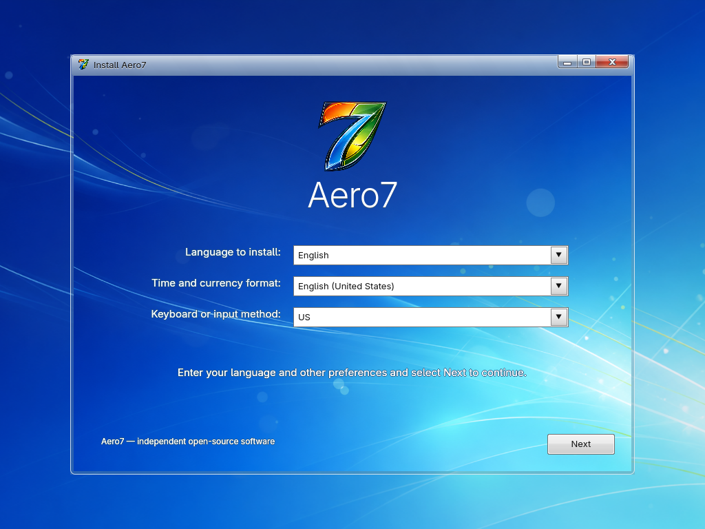
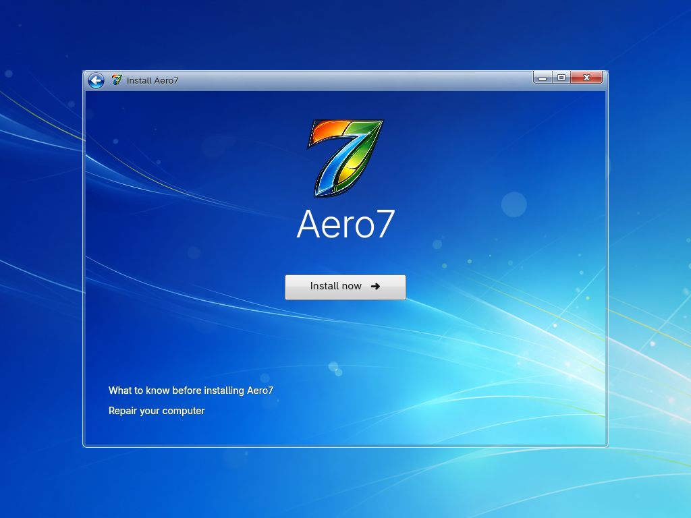
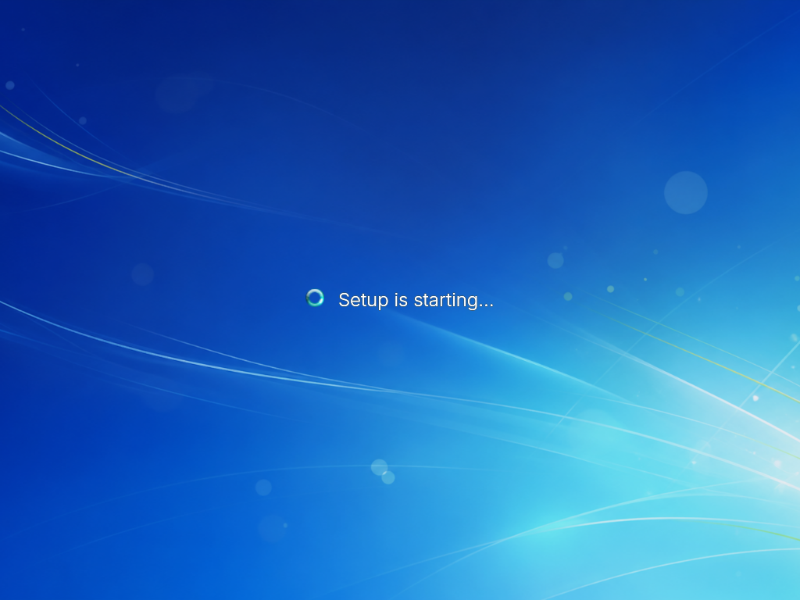
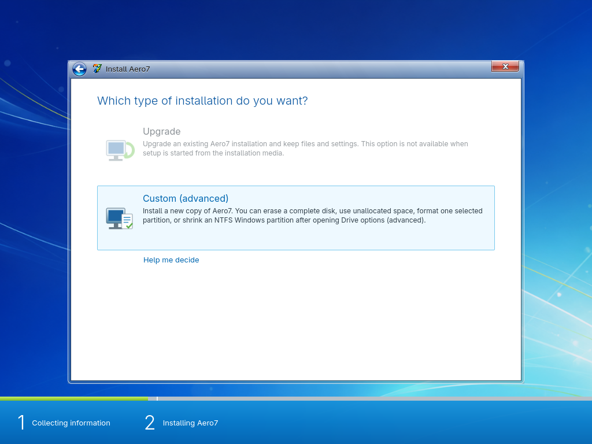
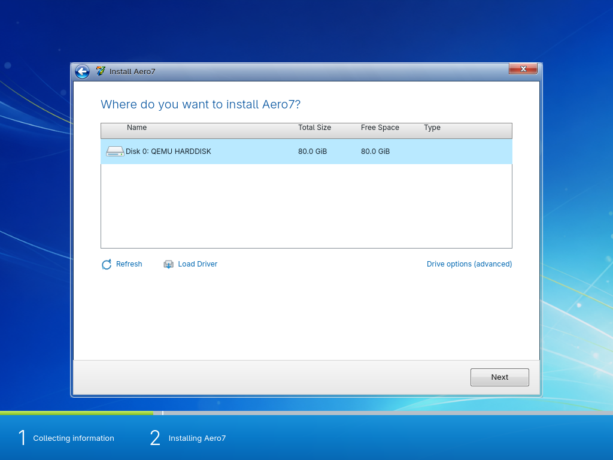
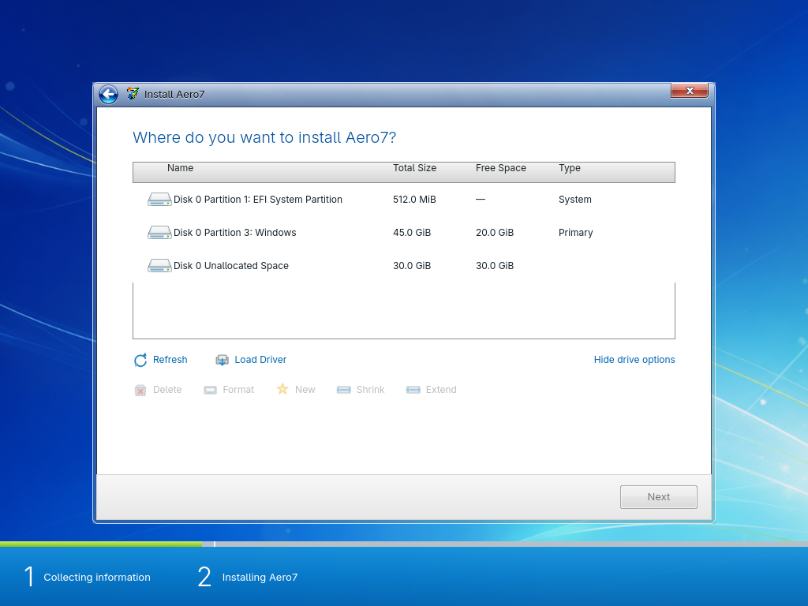
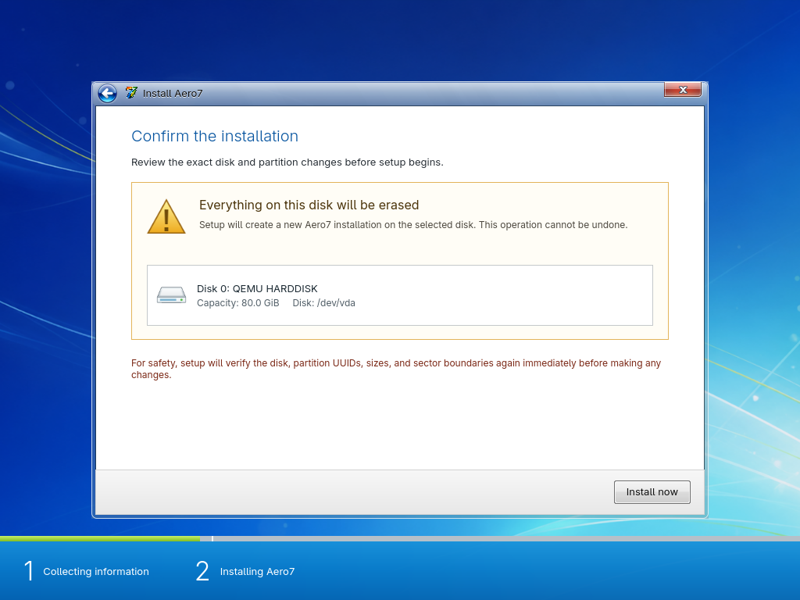
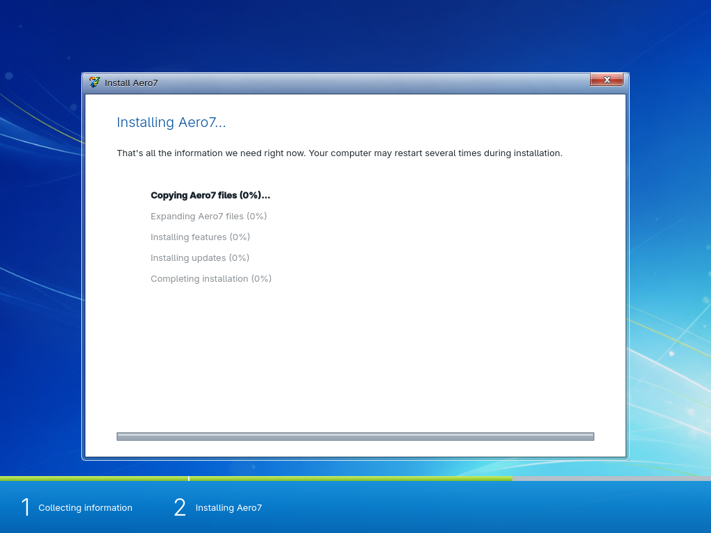
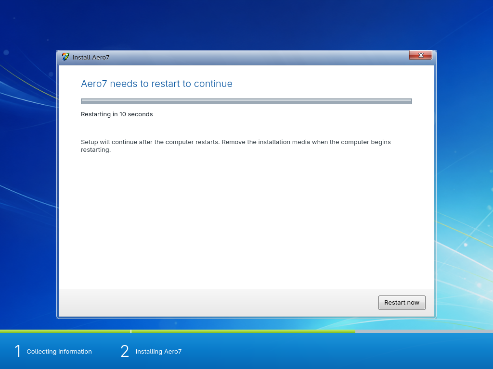

# Installer Guide

## Language and region

Choose the installer language, time and currency format, and keyboard layout.
Beta 1 currently presents the English/US choices used by the validated flow.

## Install now

Starts setup. **Upgrade** is visibly disabled because Beta 1 performs only clean
installations. **Repair your computer** asks for confirmation, starts the TTY2
recovery shell, and switches to it.

Setup briefly shows a full-screen starting transition before opening the
license page.

## License notice

The notice explains that Aero7 is an independent Linux system, lists the
open-source licensing model, warns about whole-disk, format, and shrink risks,
documents network package access, and provides the Beta no-warranty statement.
Acceptance is required before continuing.

## Installation type

Only **Custom** is active. Upgrade remains unavailable; guided preservation is
provided on the following disk page through Drive options (advanced).

## Disk selection

The backend lists only devices passing all safety rules. A valid Beta 1 parent
is an unmounted, writable, non-removable VirtIO disk that is not the live ISO
source. Basic mode selects the whole disk. Advanced mode lists its exact GPT
partitions and unallocated ranges and enables New, Format, or Shrink only where
the fixed layout fits.

| Basic disk selection | Guided advanced drive options |
| --- | --- |
|  |  |

The final confirmation repeats the exact device identity. Setup immediately
re-reads the disk and rejects it if its path, size, model, serial, major/minor
number, mount state, removability, partition UUID, filesystem, or sector
geometry has changed. Advanced setup also requires a successful partition-table
backup before its first write.

## Installing

The progress page covers:

1. copying Aero7 files;
2. expanding the base system;
3. installing features and signed Aero7 packages;
4. installing updates;
5. completing installation.

Detailed output is written to `/var/log/aero7-installer.log`.

## Restart

OVMF is configured to prefer the installed virtual disk over the still-attached
DVD after the new system becomes bootable. The installed Plymouth animation
plays before OOBE begins.

The complete gallery above is generated directly from the current QML source;
no historical installer screenshots are mixed into this page.

## Keyboard navigation

The installer supports mouse input plus Tab, Shift+Tab, Enter, Escape, and
visible keyboard focus. Alt+F2 opens recovery; Alt+F1 returns to setup.
