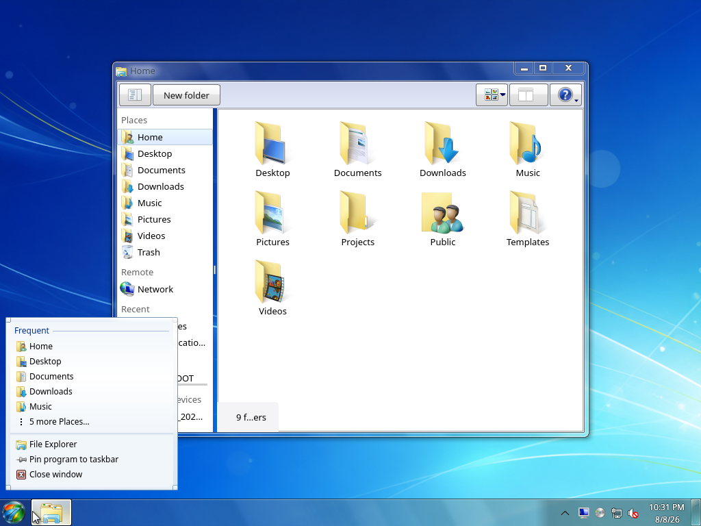
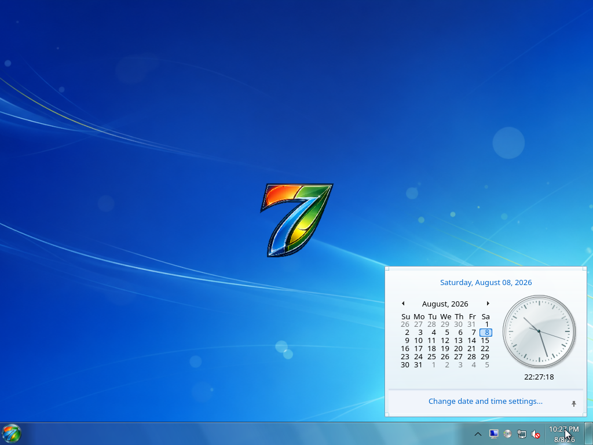
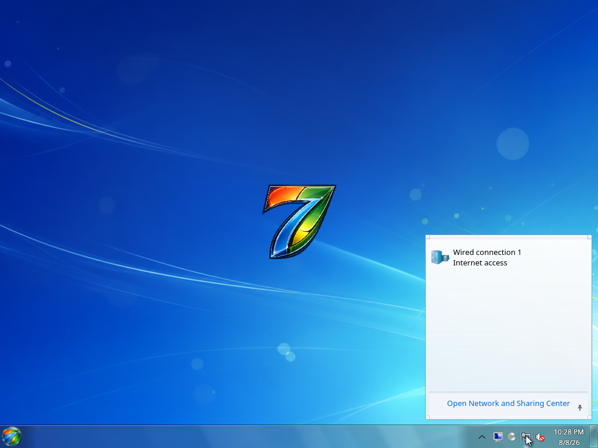
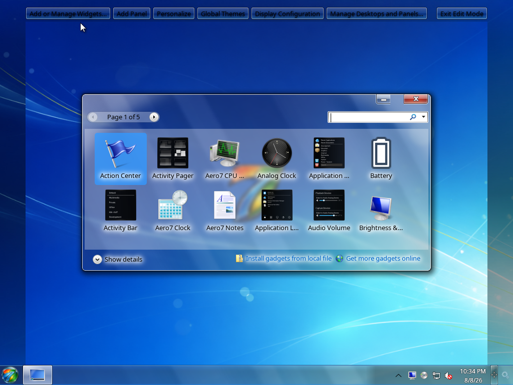
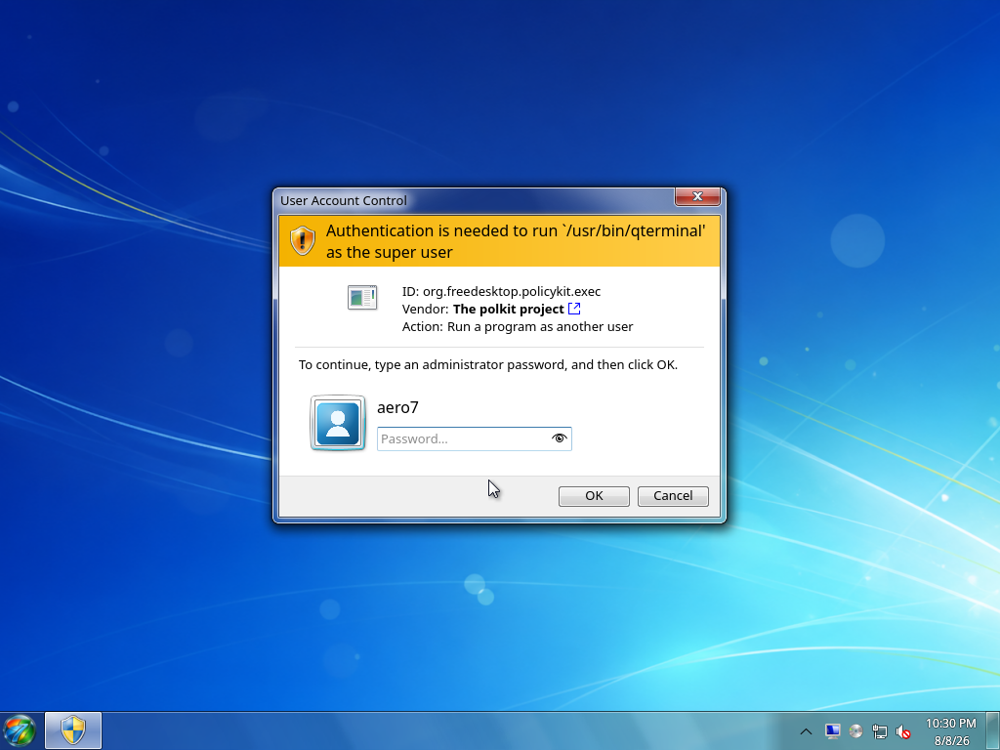
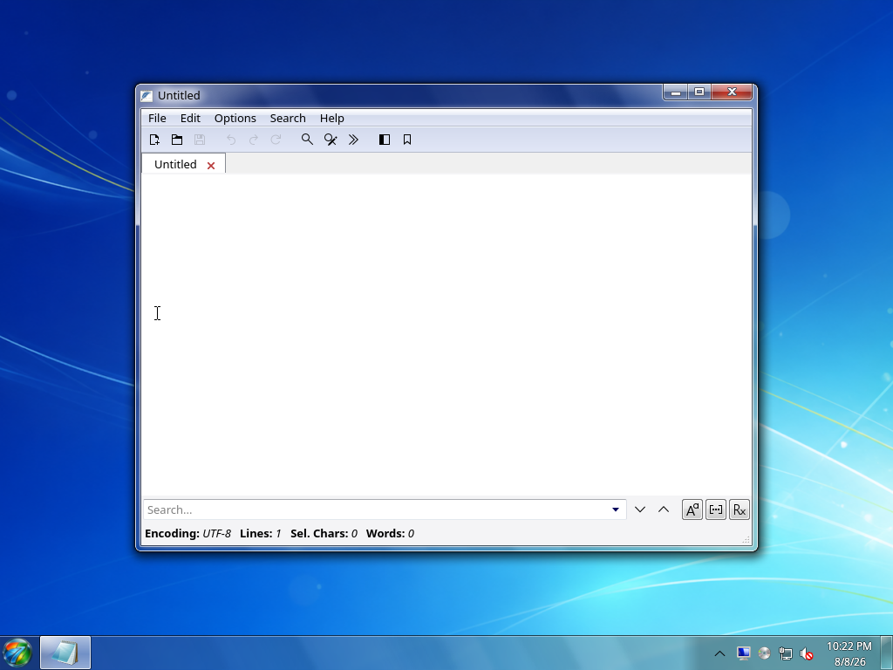
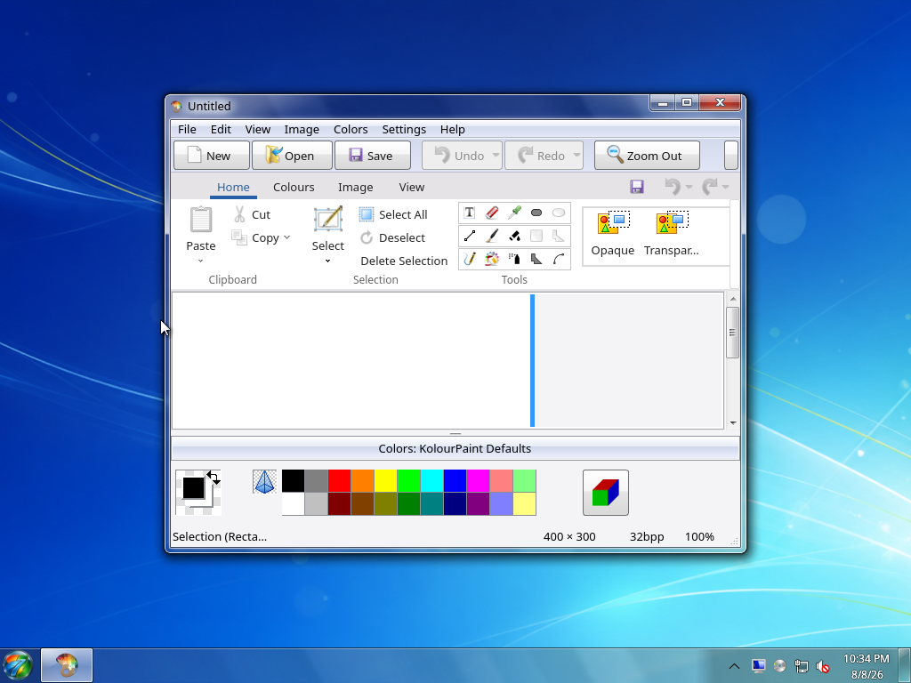
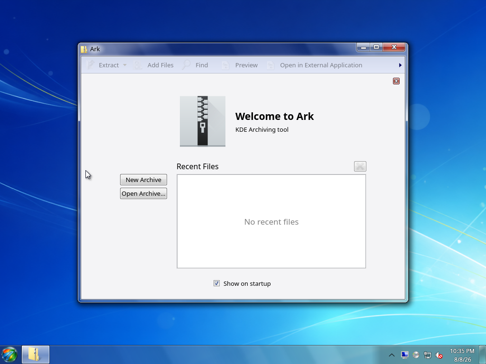
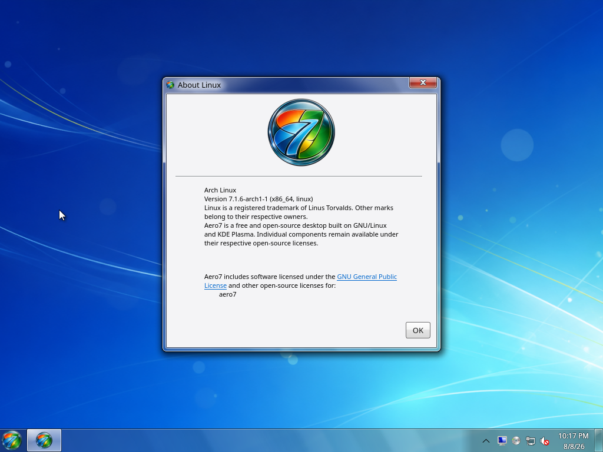

# Screenshot Gallery

These images document the current Aero7 Beta 1 candidate. Installer and OOBE
screens are deterministic captures rendered from the same Qt/QML sources used
by the ISO. Desktop and application screens were captured after a clean
installation, OOBE, and first-login repair in the documented QEMU/KVM test
profile.

## Desktop

| Start menu | All Programs |
| --- | --- |
|  |  |

| Desktop menu | Jump list |
| --- | --- |
|  |  |

| Clock and calendar | Network status |
| --- | --- |
|  |  |

| Volume | Gadgets |
| --- | --- |
|  |  |

| Lock screen | Authentication prompt |
| --- | --- |
|  |  |

## Applications

| File Explorer | Photo Viewer |
| --- | --- |
|  |  |

| Control Panel | Device Manager |
| --- | --- |
|  |  |

| Command Prompt | Task Manager |
| --- | --- |
|  |  |

| Media Player | Notepad |
| --- | --- |
|  |  |

| Calculator | Paint |
| --- | --- |
|  |  |

| Archive Manager | System Information |
| --- | --- |
|  |  |

## Setup

The complete ordered setup sequences are kept on their dedicated pages:

- [Installer Guide](Installer-Guide.md) — every installer page from language
  selection through restart;
- [First Boot and OOBE](First-Boot-and-OOBE.md) — every first-boot page through
  the desktop handoff.

The Snipping Tool uses a background region-selection overlay and copies the
result directly to the clipboard, so it does not have a persistent application
window to include here.
